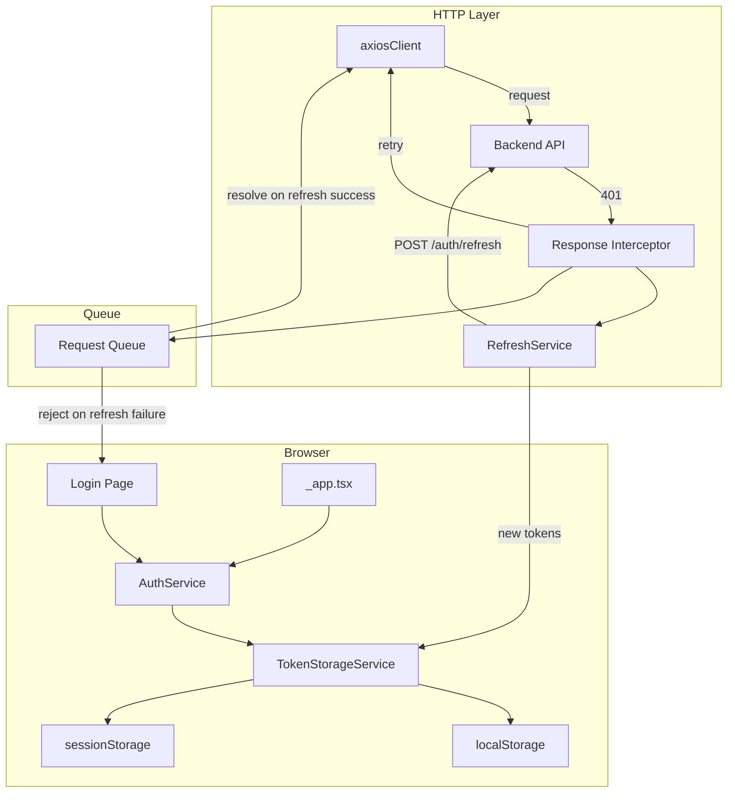
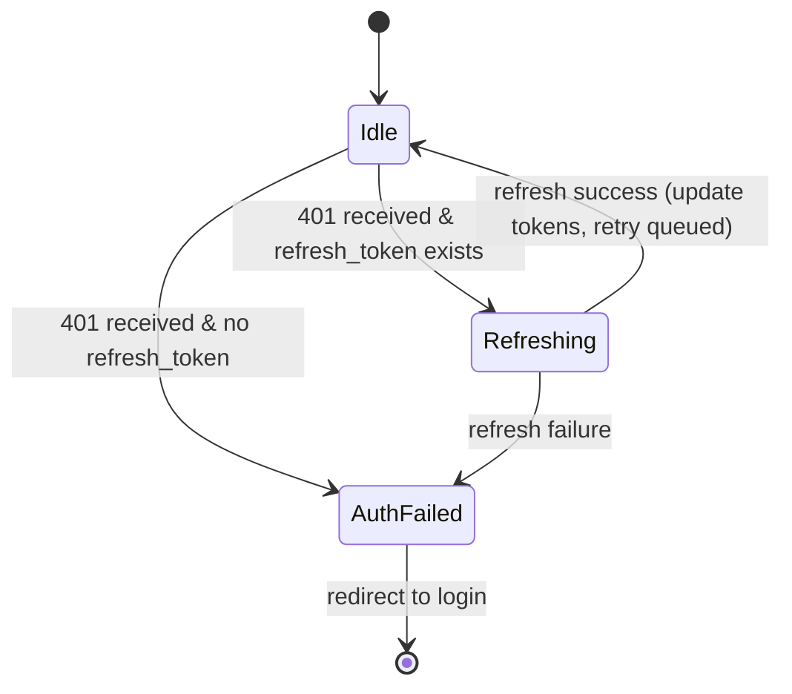

# Design Document: Persistent Login

## Overview

This design introduces persistent login capabilities to the IdexDocs frontend application. The current implementation stores only an `access_token` in `localStorage` with no refresh mechanism, no session validation on load, and no user choice for persistence behavior.

The solution adds:
- A **token refresh interceptor** on the axios client that transparently handles 401 responses
- A **TokenStorageService** abstraction that encapsulates localStorage/sessionStorage selection based on user preference
- A **"Remember me" checkbox** on the login page with i18n support
- **Session validation** on application load via `_app.tsx`
- **Concurrent request queuing** during token refresh to prevent race conditions

### Current State

| Concern | Current Implementation | Gap |
|---------|----------------------|-----|
| Token storage | `localStorage.setItem("token", ...)` in login page | No refresh token, no storage choice |
| Auth header | Request interceptor reads from `localStorage` | Static; no response interceptor for 401 |
| Session check | `_app.tsx` checks `localStorage.getItem("token")` | No expiry check, no refresh |
| Logout | N/A | No explicit logout flow |
| i18n | `i18next` with pt/es/en JSON files | No login-related keys |

### Design Goals

1. **Backward compatible** — existing `access_token` storage continues to work during migration
2. **Minimal coupling** — token refresh logic is encapsulated in a single module, not spread across components
3. **Testable** — pure functions for token validation and storage logic enable property-based testing
4. **Resilient** — concurrent 401 handling prevents duplicate refresh calls and token races

## Architecture



### Key Architecture Decisions

1. **Separate axios instance for refresh requests** — prevents circular 401 interception when the refresh endpoint itself is called.
2. **Promise-based request queue** — while a refresh is in-flight, subsequent 401s push their retry resolver onto a queue. When the refresh completes, all queued resolvers are invoked with the new token.
3. **Storage preference persisted as a flag** — a `storage_preference` key (value: `"local"` or `"session"`) stored in `localStorage` allows the app to know where to look for tokens on load.
4. **Token validation via `jwt-decode`** — already a project dependency, used to check `exp` claim without network calls.

## Components and Interfaces

### TokenStorageService

Responsible for abstracting the storage mechanism (localStorage vs sessionStorage).

```typescript
// src/lib/auth/tokenStorage.ts

export type StorageType = "local" | "session";

export interface TokenStorageService {
  getAccessToken(): string | null;
  getRefreshToken(): string | null;
  setTokens(accessToken: string, refreshToken?: string): void;
  clearTokens(): void;
  getStorageType(): StorageType;
}

export function createTokenStorage(preference: StorageType): TokenStorageService;
export function detectStoragePreference(): StorageType;
```

**Design rationale:** A factory function `createTokenStorage` returns an object that delegates to the correct `Storage` API. The preference is stored in `localStorage` (always accessible) under key `storage_preference`.

### AuthService

Coordinates login, logout, session validation, and interacts with TokenStorageService.

```typescript
// src/lib/auth/authService.ts

export interface AuthService {
  login(email: string, password: string, rememberMe: boolean): Promise<void>;
  logout(): void;
  validateSession(): Promise<boolean>;
  getAccessToken(): string | null;
  isAuthenticated(): boolean;
}
```

### RefreshService

Handles the token refresh API call and concurrent request queuing.

```typescript
// src/lib/auth/refreshService.ts

export interface RefreshService {
  refreshToken(): Promise<string>;
  isRefreshing(): boolean;
  enqueueRequest(resolve: (token: string) => void, reject: (error: Error) => void): void;
}
```

### Axios Response Interceptor

Integrates with the existing `axiosClient` to intercept 401 responses.

```typescript
// src/lib/auth/axiosInterceptor.ts

export function setupResponseInterceptor(
  axiosInstance: AxiosInstance,
  refreshService: RefreshService,
  tokenStorage: TokenStorageService,
  onAuthFailure: () => void
): void;
```

### Login Page Enhancement

The login page (`src/pages/public/login/index.tsx`) will add:
- A `rememberMe` checkbox field managed by `react-hook-form`
- i18n label using `useTranslation` hook
- Calls `AuthService.login()` instead of directly calling `LoginUser` and setting localStorage

### i18n Keys

New keys added to each locale file:

| Key | PT | ES | EN |
|-----|----|----|-----|
| `keepLoggedIn` | Manter logado | Mantener sesión | Keep logged in |
| `loginError` | Não foi possível completar o login | No se pudo completar el inicio de sesión | Unable to complete login |

## Data Models

### Token DTOs

```typescript
// Updated src/lib/http-service/tokenService/dto.ts

export interface LoginRequestDTO {
  email: string;
  password: string;
}

export interface LoginResponseDTO {
  access_token: string;
  refresh_token?: string;
  token_type: string;
}

export interface RefreshRequestDTO {
  refresh_token: string;
}

export interface RefreshResponseDTO {
  access_token: string;
  refresh_token?: string;
}
```

### Storage Keys

| Key | Storage | Description |
|-----|---------|-------------|
| `access_token` | localStorage or sessionStorage | JWT access token |
| `refresh_token` | localStorage or sessionStorage | Refresh token |
| `storage_preference` | localStorage (always) | `"local"` or `"session"` |

### JWT Payload (decoded for validation)

```typescript
interface JwtPayload {
  exp: number;  // Unix timestamp
  sub: string;  // User ID
  iat: number;  // Issued at
}
```

### State Machine: Token Refresh Flow



## Correctness Properties

*A property is a characteristic or behavior that should hold true across all valid executions of a system — essentially, a formal statement about what the system should do. Properties serve as the bridge between human-readable specifications and machine-verifiable correctness guarantees.*

### Property 1: Token storage round-trip

*For any* valid non-empty, non-whitespace token string (access or refresh), storing it via TokenStorageService and then retrieving it should return the exact same string value.

**Validates: Requirements 1.1, 1.2, 2.3, 7.2**

### Property 2: Invalid tokens rejected from storage

*For any* string composed entirely of whitespace characters (including the empty string), attempting to store it as a token value should result in the token not being present in storage.

**Validates: Requirements 1.4**

### Property 3: Storage mechanism selection based on rememberMe

*For any* valid token pair and boolean `rememberMe` value, when tokens are stored with `rememberMe=true` they should be retrievable from localStorage (and not sessionStorage), and when stored with `rememberMe=false` they should be retrievable from sessionStorage (and not localStorage).

**Validates: Requirements 3.3, 3.4, 3.6**

### Property 4: Token expiration classification

*For any* JWT with an `exp` claim, the validation function should classify it as "valid" when `exp` is in the future and "expired" when `exp` is in the past. For any non-JWT string (malformed), it should classify it as "invalid".

**Validates: Requirements 4.1, 4.3, 4.5**

### Property 5: Logout clears all tokens

*For any* set of stored tokens (access and/or refresh, in any storage mechanism), after invoking logout, neither token should be retrievable from any storage mechanism.

**Validates: Requirements 5.1, 5.2**

### Property 6: Single refresh call for concurrent 401s

*For any* positive number N of concurrent requests that receive 401 responses while a refresh token is available, exactly one refresh API call should be made, and all N requests should resolve with the same new access token.

**Validates: Requirements 6.1, 6.2, 2.5**

### Property 7: 401 interceptor retry with new token

*For any* API request URL (excluding the refresh endpoint) that receives a 401 response when a refresh token exists, the interceptor should retry the original request exactly once with the new access token in the Authorization header.

**Validates: Requirements 2.1, 2.2**

### Property 8: Refresh failure rejects all queued requests

*For any* positive number N of requests queued during a token refresh, if the refresh fails, all N queued requests should be rejected (not left pending).

**Validates: Requirements 6.3, 2.4**

### Property 9: Refresh API error propagation

*For any* non-success HTTP status code (4xx or 5xx) returned by the refresh endpoint, the refresh service function should reject with an error, enabling the caller to handle the failure.

**Validates: Requirements 7.4**

## Error Handling

### Error Categories and Responses

| Error Scenario | Response | User Impact |
|---------------|----------|-------------|
| Storage write failure on login | Show i18n error toast, do NOT proceed to authenticated state | User sees error, stays on login |
| Refresh token expired/invalid | Clear all tokens, redirect to login | User must re-authenticate |
| Refresh network error | Clear all tokens, redirect to login | User must re-authenticate |
| Refresh timeout (>10s) | Treat as failed refresh, clear tokens, redirect | User must re-authenticate |
| Malformed access token on load | Clear tokens, redirect to login | User must re-authenticate |
| Storage clear failure on logout | Still clear headers, still redirect | Stale tokens may remain in storage (best-effort) |
| Logout during pending refresh | Cancel refresh, reject queued requests, proceed with logout | Clean logout |

### Error Handling Strategy

1. **Fail-safe defaults**: When in doubt, redirect to login. A false logout is always preferable to an unauthorized state leak.
2. **No silent failures**: All error paths either show a user-facing message or trigger navigation to login.
3. **Graceful degradation**: If refresh token is absent, the system operates without auto-renewal (same as current behavior).

### Error Toast Integration

Errors will use the existing `react-toastify` setup already present on the login page. For auth errors during app usage, a toast is shown briefly before redirecting to login.

## Testing Strategy

### Property-Based Testing (fast-check)

The project already has `fast-check` v4.6.0 installed and `jest` configured. Property-based tests will validate the correctness properties defined above.

**Configuration:**
- Library: `fast-check` (already in devDependencies)
- Runner: `jest` (already in devDependencies)
- Minimum iterations: 100 per property
- Tag format: `Feature: persistent-login, Property {N}: {title}`

**Property test targets:**
- `TokenStorageService` — Properties 1, 2, 3, 5 (pure storage logic)
- `tokenValidation` utility — Property 4 (JWT decode + expiry check)
- `RefreshService` queue — Properties 6, 8 (concurrent behavior via mocks)
- Axios interceptor — Property 7 (retry logic via mocked axios)
- `RefreshService` API — Property 9 (error propagation via mocked HTTP)

### Unit Tests (example-based)

- Login page renders "Remember me" checkbox with correct i18n labels (pt, es, en)
- Login page defaults checkbox to unchecked
- Storage write failure shows error message
- No refresh token → redirect on 401 without refresh attempt
- Refresh timeout configured at 10 seconds
- Separate axios instance for refresh does not include Authorization header
- Logout during pending refresh cancels and rejects

### Integration Tests

- Full login flow: credentials → token storage → redirect to secure route
- Session validation on app load with valid token
- Session validation on app load with expired token → refresh → success
- Refresh endpoint returns new refresh_token → updated in storage

### Test File Structure

```
src/__tests__/
  auth/
    tokenStorage.property.test.ts    → Properties 1, 2, 3, 5
    tokenValidation.property.test.ts → Property 4
    refreshQueue.property.test.ts    → Properties 6, 8
    axiosInterceptor.property.test.ts → Property 7
    refreshService.property.test.ts  → Property 9
    authService.unit.test.ts         → Example-based unit tests
    login.integration.test.tsx       → Integration tests
```

